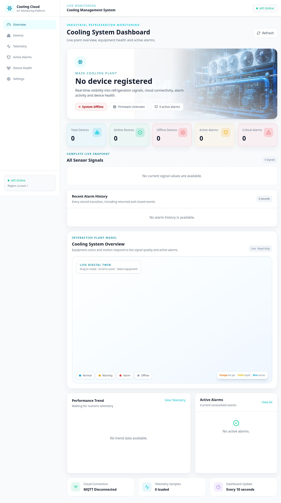
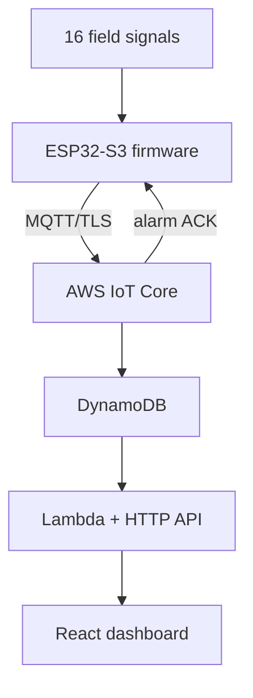

# Cooling Monitoring Platform

[](firmware/)
[](cooling-dashboard-digital-twin-source/)
[](docs/05-aws-cloud-architecture.md)
[](#scope-and-safety)

An end-to-end cold-room monitoring system built around an ESP32-S3, resilient alarm journaling, AWS IoT Core, serverless APIs, and a live web dashboard with a reactive 3D digital twin.

> **Live dashboard:** https://dashboard-production.d1dxvn6cbsrarr.amplifyapp.com/  
> **Arabic introduction:** [README_AR.md](README_AR.md) · **Complete documentation:** [docs/README.md](docs/README.md)



## What the system does

- Samples and validates 16 temperature, humidity, safety, equipment, current, and battery signals.
- Publishes live telemetry every 10 seconds and retained device health every 30 seconds.
- Detects alarm transitions locally, persists them to `journal.bin`, and uploads them in order.
- Advances the persistent upload cursor only after a validated application acknowledgement.
- Stores telemetry, device status, and alarm history in DynamoDB for API access.
- Presents live status, trends, alarms, health diagnostics, and an interactive digital twin.

## System at a glance



| Layer | Technology | Responsibility |
|---|---|---|
| Field | PT100, Vaisala HMP110, digital safety inputs, current/voltage inputs | Physical measurements and equipment state |
| Edge | ESP32-S3, FreeRTOS, ESP-IDF 5.3.1 | Signal processing, alarms, durable storage, MQTT |
| Cloud | AWS IoT Core, IoT Rules, DynamoDB, Lambda, API Gateway | Ingestion, persistence, query API |
| Web | React 19, TypeScript, Vite, TanStack Query, Recharts, Three.js | Operations dashboard and digital twin |
| Delivery | AWS Amplify | Continuous frontend build and hosting |

## Repository layout

```text
.
├── firmware/                                ESP32-S3 firmware
├── cooling-dashboard-digital-twin-source/   React dashboard
├── docs/                                    Architecture and operations docs
└── amplify.yml                              Amplify build configuration
```

## Quick start

### Dashboard

```bash
cd cooling-dashboard-digital-twin-source
npm ci
```

Create `.env.local`:

```dotenv
VITE_API_BASE_URL=https://YOUR_API_ID.execute-api.us-east-1.amazonaws.com
```

Run locally:

```bash
npm run dev
```

Production check:

```bash
npm run lint
npm run build
```

### Firmware

Install ESP-IDF 5.3.1, open an ESP-IDF terminal, then:

```bash
cd firmware
idf.py set-target esp32s3
idf.py reconfigure
idf.py build
idf.py -p COMx flash monitor
```

Certificate files and Wi-Fi configuration are deployment-specific. Never commit private keys or production secrets.

## Scope and safety

The current product is **monitoring-only**. It observes equipment and visualizes state; it does not issue refrigeration control commands. Any future control capability must be developed as a separate, safety-reviewed subsystem with authorization, interlocks, audit logging, and fail-safe behavior.

## Documentation map

| Document | Purpose |
|---|---|
| [Project overview](docs/01-project-overview.md) | Goals, scope, actors, and major capabilities |
| [System architecture](docs/02-system-architecture.md) | End-to-end topology and data flows |
| [Firmware architecture](docs/03-firmware-architecture.md) | Tasks, queues, persistence, and startup |
| [Hardware architecture](docs/04-hardware-architecture.md) | Sensors, I/O modules, buses, and signal map |
| [AWS architecture](docs/05-aws-cloud-architecture.md) | MQTT ingestion, storage, API, and hosting |
| [MQTT contract](docs/06-mqtt-contract.md) | Topics, QoS, payloads, and ACK protocol |
| [Data model](docs/07-data-model.md) | DynamoDB keys and item shapes |
| [API reference](docs/08-api-reference.md) | Read-only HTTP endpoints |
| [Dashboard & digital twin](docs/09-dashboard-digital-twin.md) | UI pages and data-driven visual behavior |
| [Testing](docs/10-testing.md) | Firmware, cloud, API, and UI verification |
| [Deployment](docs/11-deployment.md) | Firmware and dashboard release workflow |
| [Troubleshooting](docs/12-troubleshooting.md) | Common failures and diagnostic checks |

## Status

The repository contains a working simulation-oriented reference implementation. The dashboard is deployed and the API can remain online while the physical/simulated device is offline. Hardware register addresses marked as undefined in the signal registry must be finalized during real commissioning.

## License

No license has been declared yet. Until a license file is added, all rights remain with the repository owner.
