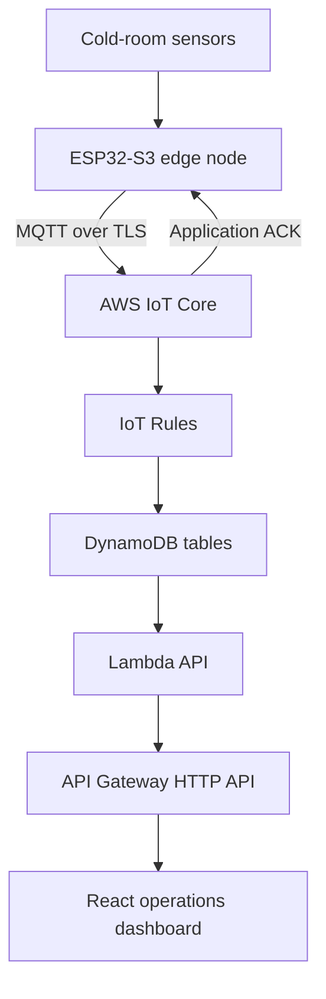
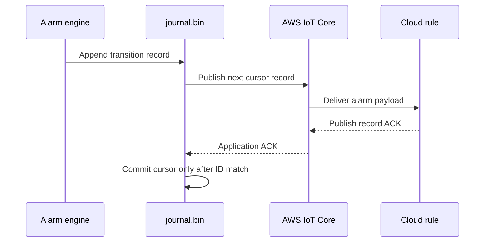

# System Architecture

## Context

## Data classes

| Class | Behavior | Persistence |
|---|---|---|
| Telemetry | Latest 16-signal snapshot, every 10 seconds, QoS 0 | Cloud time-series table; not journaled on device |
| Device status | Health snapshot every 30 seconds, QoS 1, retained | Latest device item |
| Alarm transition | Ordered event, QoS 1 plus application ACK | Durable device journal and cloud alarm history |
| Runtime shadow | Named AWS IoT Device Shadow synchronization | AWS IoT Shadow service |

## Alarm reliability flow

Broker PUBACK and application ACK are intentionally different. A broker acknowledgement proves MQTT delivery to the broker; the application acknowledgement proves that the cloud workflow accepted the specific `record_id`.

## Failure boundaries

- The signal-processing and alarm pipeline continues when Wi-Fi is unavailable.
- Telemetry and status skip offline publish cycles because they represent live state.
- Alarm records remain in the journal until acknowledged.
- The web app may report `API Online` while the device itself is offline.
