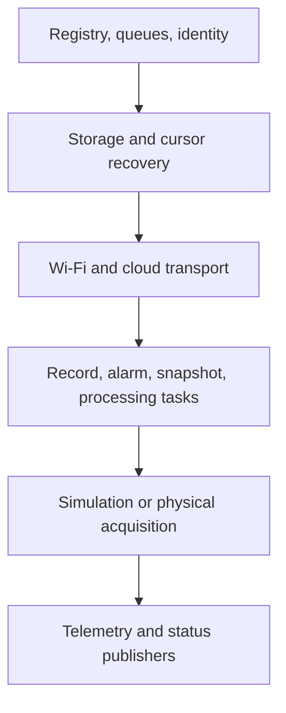

# Firmware Architecture

## Platform

- Target: ESP32-S3, 4 MB flash
- Framework: ESP-IDF 5.3.1
- Runtime: FreeRTOS tasks and queues
- Serialization: cJSON
- Cloud transport: MQTT over TLS to AWS IoT Core
- Persistent data: local alarm journal plus upload cursor

## Startup order

The application initializes identity and storage before producers, validates the cursor against the recovered journal, starts downstream consumers, connects Wi-Fi/MQTT when enabled, then starts simulation and live publishers.

## Major components

| Component | Responsibility |
|---|---|
| `signal_registry` | Authoritative metadata for 16 signals |
| `signal_processing` | Validity, quality, scaling, and filtering |
| `signal_snapshot_manager` | Consistent latest-value snapshot |
| `alarm_engine` | Alarm state and transition generation |
| `record_builder` | Converts events into durable records |
| `storage_manager` | Journal mount, append, recovery, and reads |
| `upload_cursor` | Persistent next offset and last acknowledged record |
| `cloud_uploader` | Ordered alarm upload and application ACK validation |
| `telemetry_publisher` | Best-effort 10-second snapshot publishing |
| `device_status_publisher` | Retained 30-second health publishing |
| `runtime_shadow` | Named runtime-shadow synchronization |
| `simulation_engine` | Continuous deterministic test scenarios |

## Store-and-forward invariant

The uploader never skips an unsupported or failed record and never commits the cursor after publish alone. The cursor moves only when the ACK contains `status: "ok"` and the expected `record_id`.

## Connectivity fault testing

`CONFIG_FIRMWARE_WIFI_FAULT_TEST` enables a one-shot Wokwi test: 30 seconds online, 60 seconds forced offline, then restored connectivity. Alarm generation and local storage continue during the outage so replay can be verified.
