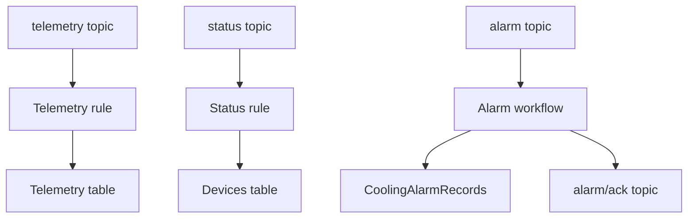

# AWS Cloud Architecture

## Services

| Service | Role |
|---|---|
| AWS IoT Core | Mutual-TLS MQTT endpoint and named shadow service |
| IoT Rules | Route telemetry, status, and alarms into persistence workflows |
| DynamoDB | Store latest devices, time-ordered telemetry, and alarm history |
| Lambda | Read/query tables and build dashboard responses |
| API Gateway HTTP API | Expose read-only routes with CORS |
| AWS Amplify Hosting | Build and serve the React application from Git |

## Ingestion

The IoT policy should use the least privilege necessary for the device client ID and its topic namespace. Avoid account-wide `*` resources in production.

## Online/offline meaning

The device publishes `status: online` only when Wi-Fi has an IP address and MQTT is connected and ready. The retained online record alone cannot prove continued availability after power loss; the cloud should calculate offline state using the last received status timestamp and a timeout greater than the 30-second publication interval.

## Configuration

The dashboard requires the Amplify environment variable `VITE_API_BASE_URL`. DynamoDB table names belong in Lambda environment variables, not in browser code.
