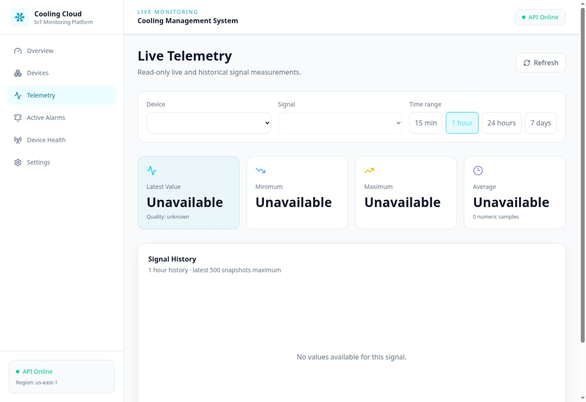
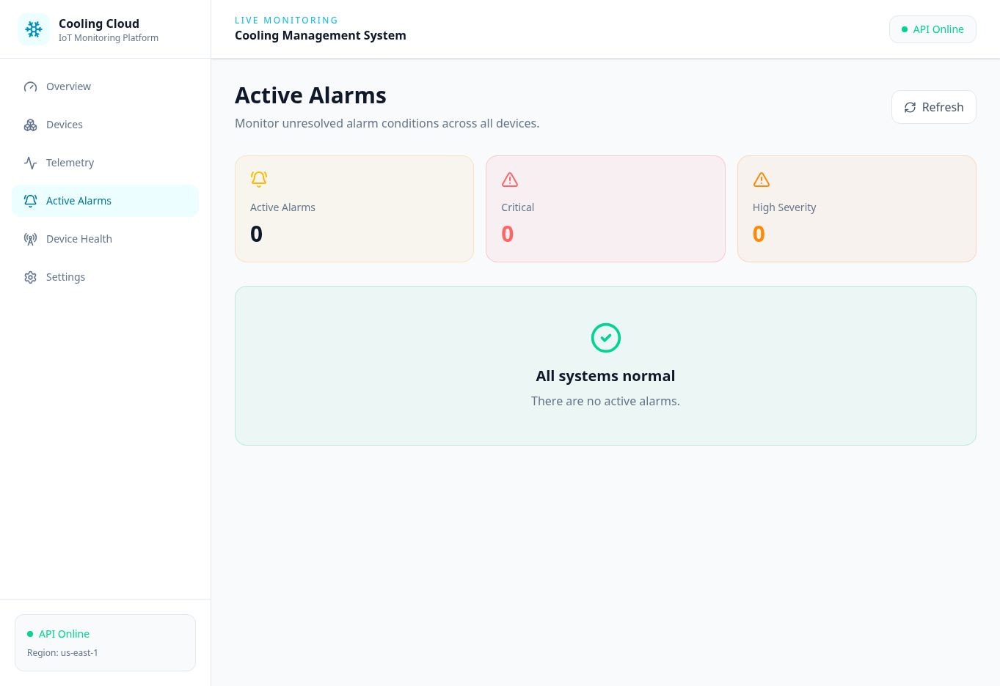

# Dashboard and Digital Twin

## Frontend stack

React 19, TypeScript, Vite, React Router, TanStack Query, Axios, Recharts, Three.js, React Three Fiber, Drei, Tailwind CSS, and Lucide icons.

## Routes

| Route | Screen |
|---|---|
| `/` | Plant overview, KPIs, latest signals, alarms, trends, and digital twin |
| `/devices` | Device inventory |
| `/devices/:deviceId` | Device details |
| `/telemetry` | Signal selection, statistics, and history |
| `/alarms` | Active alarms and recent transition history |
| `/health` | Connectivity, storage, cursor, and backlog diagnostics |
| `/settings` | Read-only/current configuration presentation |

## Digital twin behavior

The model is a visualization of one coherent refrigeration loop. Signal values drive equipment state and visual effects:

| Signal/state | Visual response |
|---|---|
| `COMPRESSOR_RUN=false` | Compressor motion and refrigerant-cycle animation stop |
| `EVAP_FAN_RUN=false` | Evaporator fan rotation and airflow stop |
| `LEAK_ALARM=true` | Leak effect appears at the pipe and collects below |
| `POWER_FAILURE=true` | Powered equipment stops and electrical fault indication appears |
| Room/air temperature | Cold-room zone color changes continuously |
| `COMPRESSOR_CURRENT` | Animation intensity/speed reflects load |
| Active alarm | The responsible equipment is highlighted red |
| Signal quality | Tooltips and equipment state distinguish good, stale, fault, and unavailable data |

The user can rotate, zoom, and select equipment. The model remains read-only; interactions do not send control commands.

## Data refresh

The overview communicates a 10-second dashboard update cadence. API health and device health are separate: `API Online` means the HTTP backend responds, while device online state comes from status data and freshness logic.

