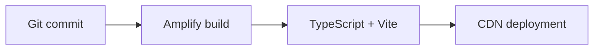

# Deployment Guide

## Dashboard CI/CD

AWS Amplify is configured by the repository-root `amplify.yml` with application root `cooling-dashboard-digital-twin-source`, `npm ci`, `npm run build`, and `dist` artifacts.



Set `VITE_API_BASE_URL` in the Amplify branch environment, connect Amplify to the intended deployment branch, and use SPA rewrite rules so client-side routes resolve to `index.html`.

## Local frontend release check

```bash
cd cooling-dashboard-digital-twin-source
npm ci
npm run lint
npm run build
npm run preview
```

## Firmware release

1. Install and activate ESP-IDF 5.3.1.
2. Configure Wi-Fi and AWS certificates outside source control.
3. Confirm the IoT endpoint, thing name, client ID, topic policy, and runtime shadow permissions.
4. Build and flash:

```bash
cd firmware
idf.py fullclean
idf.py set-target esp32s3
idf.py reconfigure
idf.py build
idf.py -p COMx flash monitor
```

5. Verify the expected MQTT topics and status/telemetry intervals.

## Release checklist

- Firmware and dashboard versions are recorded.
- No private key, certificate secret, password, or AWS account identifier is staged.
- API CORS and authentication match the target environment.
- DynamoDB backups or point-in-time recovery are enabled for production.
- Rollback commit/build is known before deployment.
